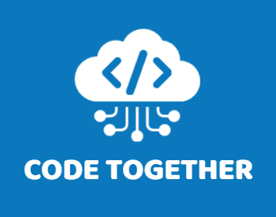

    

Multiplayer code editor inspired by [Khan Academy's Embedded Editor](https://www.khanacademy.org/computer-programming/new/pjs), built using Svelte and TypeScript.

Code Together was intended to be used by teachers and peer tutors. Originally created for fully-online classes, I've found Code Together can be used in the classroom, too.

## Usage

There are two versions of Code Together:
 1. A user-friendly page with an examples section, and access to copy the invite link. This page will generate your room ID for you.\
    `https://code.xacer.dev/`
 2. A minimalist version for specialized classes. Teachers need to pick an ID for their room.\
    `https://code.xacer.dev/room?id=<your-id-here>`

## Features

The main priority of Code Together is **safety**. All operations happen in a sandboxed `iframe` element.

To avoid infinite loops crashing the page, Code Together runs user code in a separate thread via **Web Workers**. This means it avoids the code injection techniques that Khan Academy uses to prevent infinite loops.

The editor supports most of the same **Processing.js** library that Khan Academy uses. Specifically, I use a modified version of [ski.js](https://github.com/thelegendski/ski.js/) that can be found under `/static/_worker.js`.

## Planned updates

1. Loading and saving from **Khan Academy**. The vision is for two Khan Academy users to be able to work simultaneously on a project by loading it into Code Together, editing the code, then saving it back to a Khan Academy project.
2. Quality of life features such as **number scrubbing** and **color pickers**. I'm working on number scrubbing in the `number-scrubber` branch.
3. Helpful **error messages**. It would be awesome to somehow incorporate Large Language Models to get personalized feedback; in the meantime, I may end up creating a better version of Error Buddy (from Khan Academy's editor).

## Credits

Thanks to DesignEvo for the free logo creator.